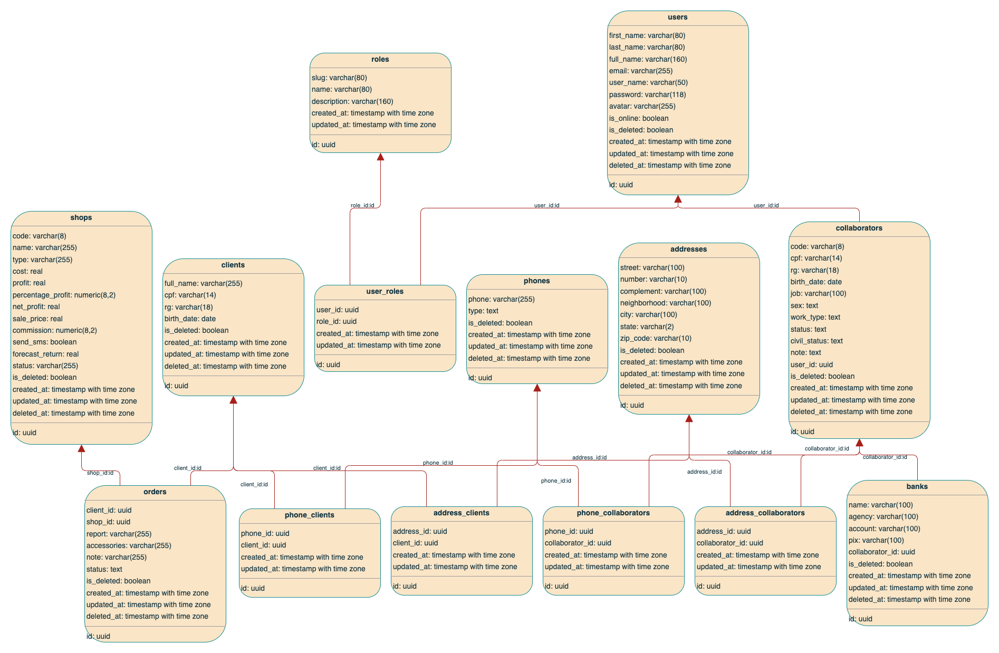

<h1 align="center">
  <br>
  
  <br>
  Agendamento e inventário - <a href=".azure/assets/images/logo.png">PDA Soluções</a>
  <br>
</h1>

<p align="center">
 <strong>Soluções completas em inventário de estoque</strong>
</p>

<br>

<p align="center">
  <a href="#bookmark-about">Sobre</a>&nbsp;&nbsp;&nbsp;|&nbsp;&nbsp;&nbsp;
  <a href="#computer-technologies">Tecnologias</a>&nbsp;&nbsp;&nbsp;|&nbsp;&nbsp;&nbsp;
  <a href="#wrench-tools">Ferramentas</a>&nbsp;&nbsp;&nbsp;|&nbsp;&nbsp;&nbsp;
  <a href="#package-installation">Instalação</a>&nbsp;&nbsp;&nbsp;|&nbsp;&nbsp;&nbsp;
  <a href="#memo-license">License</a>
</p>

<br>

## :bookmark: Sobre

**Pda Agendamentos** é um projeto desenvolvido para a PDA Soluções, com o objetivo de agendar e gerenciar os inventários de estoque.

<kbd>
  
</kbd>

<br>

## :computer: Tecnologias

- **[Typescript](https://www.typescriptlang.org/)**
- **[Node.js](https://nodejs.org/)**
- **[Eslint](https://eslint.org/)**
- **[Prettier](https://prettier.io/)**
- **[Next.js](https://nextjs.org/)**
- **[PostgreSQL](https://www.postgresql.org/)**
- **[Knex.js](http://knexjs.org/)**
- **[Argon2](https://www.npmjs.com/package/argon2)**
- **[RxJs](https://rxjs-dev.firebaseapp.com/)**
- **[Objection.js](https://vincit.github.io/objection.js/)**
- **[Fastify](https://www.fastify.io/)**

<br>

## :wrench: Ferramentas

- **[WebStorm](https://www.jetbrains.com/webstorm/)**
- **[Docker](https://www.docker.com/)**
- **[Docker Compose](https://docs.docker.com/compose/)**
- **[Insomnia](https://insomnia.rest/)**
- **[DataGrip](https://www.jetbrains.com/datagrip/)**
- **[OpenAPI](https://swagger.io/specification/)**
- **[Azure DevOps](https://azure.microsoft.com/pt-br/services/devops/)**

<br>

## :package: Instalação

### :heavy_check_mark: **Pré-requisitos**

O seguinte software deve ser instalado:

- **[Node.js](https://nodejs.org/en/)**
- **[Git](https://git-scm.com/)**
- **[NPM](https://www.npmjs.com/)** ou **[Yarn](https://yarnpkg.com/)**

<br>

### :arrow_down: **Clonando o repositório**

```sh
  $ git clone pdasolucoes@vs-ssh.visualstudio.com:v3/pdasolucoes/Projeto%20Saas%20Agendamento/pda.os.api
```

<br>

### :arrow_forward: **Executando o servidor**

- :package: API

```sh
  $ cd pda.os.api
  # Instalando as dependências
  $ yarn # or npm install
  # Criando o arquivo .env
  $ cp .env.example .env
  # Executando as migrations
  $ yarn db:reset # or npm run db:reset
  # Executando o servidor
  $ yarn start:dev
```

<br>

### :writing_hand: **Autor**

| [](https://github.com/demartini) |
| ---------------------------------------------------------------------------------------------------------- |
| [Gabriel Maia](https://github.com/gabrielmaialva33)                                                        |

## License

[MIT License](./LICENSE)
